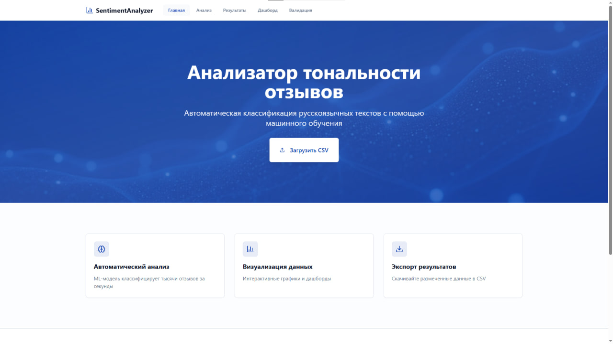
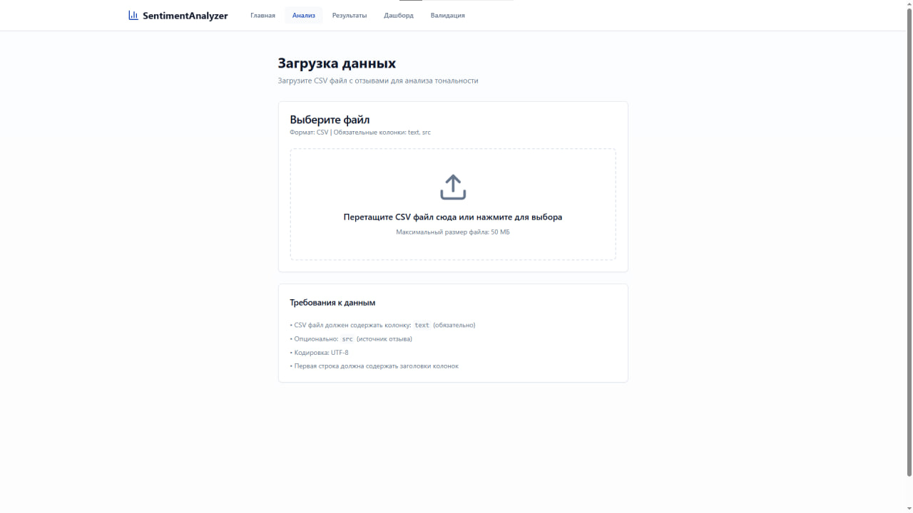
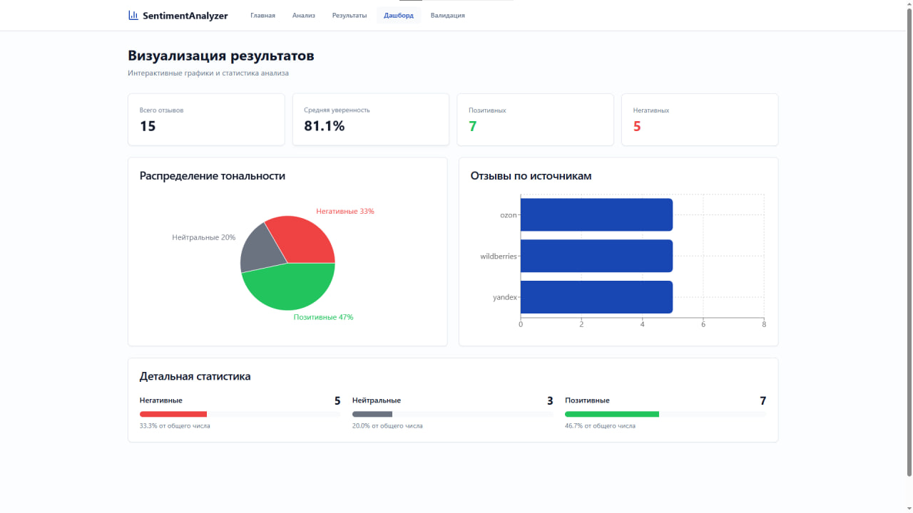
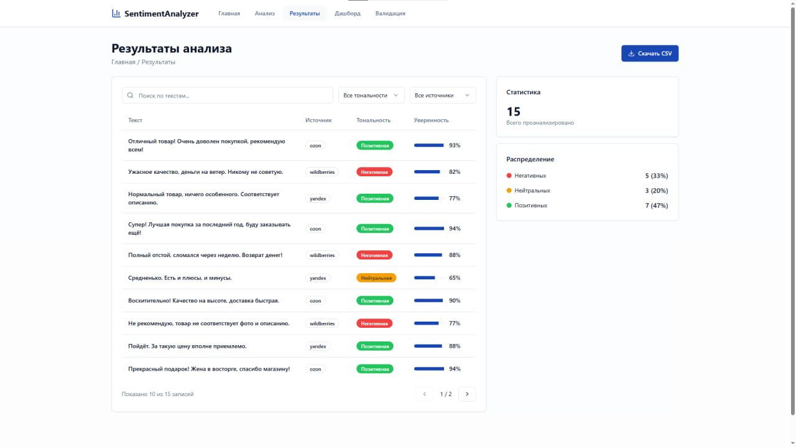

#  Анализатор тональности отзывов

Веб-приложение для автоматической классификации русскоязычных и англоязычных отзывов по тональности с использованием ML-модели на базе XLM-RoBERTa.

## Возможности

- Автоматическая классификация текстов на 3 класса: негативный, нейтральный, позитивный
- Мультиязычная поддержка (100+ языков включая русский и английский)
- Асинхронная обработка больших файлов с прогресс-баром
- Интерактивные визуализации и дашборд
- Валидация модели с расчётом Macro-F1
- Экспорт результатов в CSV
- Ручная корректировка разметки

## 📦 Предварительные требования

- Docker и Docker Compose
- Python 3.11+ (для локальной разработки)
- Node.js 18+ (для локальной разработки)
- 4GB RAM минимум

## 🚀 Быстрый старт

### Docker (рекомендуется)

```bash
git clone https://github.com/meloch287/Sentiment-analyzer.git
cd Sentiment-analyzer
docker compose up --build
```

Приложение будет доступно:
- Frontend: http://localhost:3000
- Backend API Docs: http://localhost:8000/docs

### Остановка

```bash
docker compose down
```

### Локальная разработка

**Backend:**

```bash
cd backend
python -m venv venv
venv\Scripts\activate        # Windows
source venv/bin/activate     # Linux/Mac
pip install -r requirements.txt
uvicorn app.main:app --reload --port 8000
```

**Frontend:**

```bash
cd frontend
npm install
npm run dev
```

Frontend: http://localhost:8080

## 🌐 Демо и репозитории

### Основной репозиторий
- **GitHub**: https://github.com/meloch287/Sentiment-analyzer
- **Mos.Hub (Правительство Москвы)**: https://hub.mos.ru/meloch287/sentiment-analyzer
### Live Demo (скоро)
- **Frontend**: -
- **Backend API**: -


## 📸 Скриншоты

### Главная страница


### Загрузка файла


### Dashboard с визуализациями


### Результаты анализа



## 📁 Структура проекта

```
sentiment-analyzer/
├── backend/
│   ├── app/
│   │   ├── api/
│   │   │   └── routes.py          # API эндпоинты
│   │   ├── models/
│   │   │   ├── classifier.py      # ML классификатор
│   │   │   └── preprocessing.py   # Препроцессинг текста
│   │   ├── services/
│   │   │   └── ml_service.py      # Сервис анализа
│   │   ├── core/
│   │   │   └── config.py          # Конфигурация
│   │   └── main.py                # FastAPI приложение
│   ├── training/
│   │   ├── train_model.py         # Скрипт обучения
│   │   └── evaluate.py            # Скрипт оценки
│   ├── requirements.txt
│   └── Dockerfile
├── frontend/
│   ├── src/
│   │   ├── pages/                 # Страницы приложения
│   │   ├── components/            # UI компоненты
│   │   ├── services/              # API клиент
│   │   └── store/                 # Zustand store
│   ├── package.json
│   └── Dockerfile
├── data/
│   ├── test_sample.csv            # Тестовые данные
│   └── validation_sample.csv      # Данные для валидации
├── docker-compose.yml
└── README.md
```

## 📋 Формат данных

### Входной CSV

```csv
text,src
"Отличный товар! Очень доволен покупкой!",ozon
"Ужасное качество, деньги на ветер.",wildberries
"Нормальный товар, ничего особенного.",yandex
```

| Колонка | Обязательная | Описание |
|---------|--------------|----------|
| text | Да | Текст отзыва |
| src | Нет | Источник отзыва |

### Выходной CSV

```csv
text,src,label,confidence
"Отличный товар! Очень доволен покупкой!",ozon,2,0.95
"Ужасное качество, деньги на ветер.",wildberries,0,0.89
"Нормальный товар, ничего особенного.",yandex,1,0.76
```

### Метки тональности

| Значение | Тональность |
|----------|-------------|
| 0 | Негативная |
| 1 | Нейтральная |
| 2 | Позитивная |

## 🔧 API Reference

### Base URL

```
http://localhost:8000/api
```

---

### POST /api/analyze

Загрузка CSV файла для анализа тональности.

**Request:**

```bash
curl -X POST "http://localhost:8000/api/analyze" \
  -H "Content-Type: multipart/form-data" \
  -F "file=@reviews.csv"
```

**Response:**

```json
{
  "task_id": "550e8400-e29b-41d4-a716-446655440000",
  "message": "Analysis started"
}
```

---

### GET /api/results/{task_id}

Получение результатов анализа.

**Request:**

```bash
curl "http://localhost:8000/api/results/550e8400-e29b-41d4-a716-446655440000"
```

**Response (в процессе):**

```json
{
  "status": "processing",
  "progress": 150,
  "total": 500
}
```

**Response (завершено):**

```json
{
  "status": "completed",
  "data": [
    {
      "text": "Отличный товар!",
      "src": "ozon",
      "label": 2,
      "confidence": 0.95
    }
  ],
  "stats": {
    "total": 500,
    "negative": 120,
    "neutral": 180,
    "positive": 200
  }
}
```

---

### GET /api/results/{task_id}/download

Скачивание результатов в CSV формате.

**Request:**

```bash
curl -O "http://localhost:8000/api/results/550e8400-e29b-41d4-a716-446655440000/download"
```

**Response:** CSV файл

---

### POST /api/validate

Валидация предсказаний с расчётом метрик.

**Request:**

```bash
curl -X POST "http://localhost:8000/api/validate" \
  -H "Content-Type: multipart/form-data" \
  -F "file=@validation.csv"
```

CSV должен содержать колонки `label` (предсказание) и `true_label` (истинная метка).

**Response:**

```json
{
  "macro_f1": 0.823,
  "precision": {
    "0": 0.85,
    "1": 0.78,
    "2": 0.87
  },
  "recall": {
    "0": 0.82,
    "1": 0.81,
    "2": 0.84
  },
  "confusion_matrix": [
    [192, 28, 14],
    [54, 459, 54],
    [26, 43, 364]
  ]
}
```

---

### GET /api/search

Поиск по текстам в результатах.

**Request:**

```bash
curl "http://localhost:8000/api/search?task_id=550e8400&query=отличный&source=ozon"
```

**Parameters:**

| Параметр | Тип | Обязательный | Описание |
|----------|-----|--------------|----------|
| task_id | string | Да | ID задачи |
| query | string | Да | Поисковый запрос |
| source | string | Нет | Фильтр по источнику |

**Response:**

```json
{
  "results": [
    {
      "text": "Отличный товар!",
      "src": "ozon",
      "label": 2,
      "confidence": 0.95
    }
  ]
}
```

---

### GET /api/filter

Фильтрация результатов по тональности и источнику.

**Request:**

```bash
curl "http://localhost:8000/api/filter?task_id=550e8400&label=2&source=ozon"
```

**Parameters:**

| Параметр | Тип | Обязательный | Описание |
|----------|-----|--------------|----------|
| task_id | string | Да | ID задачи |
| label | int | Нет | Фильтр по тональности (0, 1, 2) |
| source | string | Нет | Фильтр по источнику |

**Response:**

```json
{
  "results": [
    {
      "text": "Отличный товар!",
      "src": "ozon",
      "label": 2,
      "confidence": 0.95
    }
  ]
}
```

---

### PATCH /api/results/{task_id}/correct

Ручная корректировка метки тональности.

**Request:**

```bash
curl -X PATCH "http://localhost:8000/api/results/550e8400/correct?text_id=5&new_label=1"
```

**Parameters:**

| Параметр | Тип | Обязательный | Описание |
|----------|-----|--------------|----------|
| task_id | string | Да | ID задачи |
| text_id | int | Да | Индекс текста в результатах |
| new_label | int | Да | Новая метка (0, 1, 2) |

**Response:**

```json
{
  "status": "updated",
  "text_id": 5,
  "new_label": 1
}
```

---

### GET /health

Проверка состояния сервиса.

**Request:**

```bash
curl "http://localhost:8000/health"
```

**Response:**

```json
{
  "status": "healthy"
}
```

## 🎓 Обучение модели

### Файнтюнинг на своих данных

```bash
cd backend/training

python train_model.py \
  --data_path train.csv \
  --output_dir ./model \
  --model_name cointegrated/rubert-tiny2 \
  --epochs 5 \
  --batch_size 16
```

### Оценка модели

```bash
python evaluate.py \
  --model_path ./model \
  --test_path test.csv \
  --output_report metrics_report.txt
```

## 📈 Метрики модели

| Метрика | Значение |
|---------|----------|
| Macro F1 | ~0.78-0.82 |
| Inference | <2 сек на 100 отзывов (CPU) |
| Поддержка языков | 100+ (RU, EN, и др.) |

## 🛠 Технологический стек

### Backend
- Python 3.11+
- FastAPI
- PyTorch
- Transformers (Hugging Face)
- scikit-learn
- pandas, numpy

### Frontend
- React 18
- TypeScript
- Tailwind CSS
- shadcn/ui
- Recharts
- Zustand

### ML Model
- cardiffnlp/twitter-xlm-roberta-base-sentiment

### DevOps
- Docker
- Docker Compose
- GitHub Actions

## 👥 Команда Dakt

Александр Максименко - backend/frontend
Андрей Деревцов - backend/ML 
Никита Аграфенин - Frontend
Ксения Святогорова - Дизайн